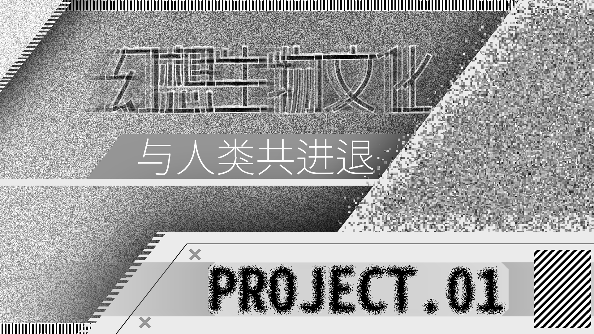

# 幻想生物：从神明到伙伴，我们如何与“怪物”共生

> **引子：从何而来，为何而来**
>
> 幻想，与人类密不可分。而幻想生物，则以千变万化的模样，与人类共同发展。
> 从远古壁画到游戏电影，从创世神话到流行文化。幻想生物无处不在。
> 怪物是如何从本源恐惧，步步进化为被解构、重塑、消费的商品的？它又是怎么从简单的动物拼接，重塑为复杂的生物世界的？
> 本期铸解，我们将会深入幻想生物的本质，看看这些“怪物”是如何与我们共同发展的。

## PART1：恐惧支配下的生存智慧

文明初期，人们都在慢慢探索着这个世界，无知、好奇、恐惧，驱动着人们构建出一套合理的“百科全书”。

在这一阶段，主要有两类幻想生物：**神化生物**与**神话生物**。

**神化生物**，是科技水平与认知水平限制下的产物。人们通过口耳相传，将远方的真实生物误认为另一形象并逐步深化。犀牛会被想象成独角兽，海牛会被想象为美人鱼。

**神话生物**，是这一阶段下的主要生物，形成原因则更为复杂。
1.  **满足人类心理防御的需要。** “已知的恐惧比未知的恐惧更容易处理”。因此，如果给恐惧取名，便可以将未知的恐惧转化为已知。将恐惧具象化，那么就有了针对的方法。人们可以以祭祀、战斗、设置禁忌等方式规避它、解决它。这是一种心理上的解决策略，而不是科学解释。
2.  **用于划定行为的边界。** 一方面，它可以强化“禁忌”：很多文化中都包含“食人怪”“变形成野兽的人”，这一设计是为了惩罚违反社会伦理的人。另一方面，在地图中与领地边缘会标注出“此处有龙”，用于阻止族人们前往危险地带，起到了警示牌的作用。
3.  **用于“图腾化”。** 这是一种强化部落认同的方案。许多部落相信自己是某种生物的后代，不仅有熊、鹰、虎等现实中的动物，更有龙、凤、狮鹫等幻想生物。这部分神话生物不是用于解释自然，而是为了强化集体凝聚力。通过崇拜象征着力量的生物这一行为，人们展现出了跨越生理极限的愿望。
4.  **用于“合法化”统治权力。** 统治者声称自己拥有神兽的血统或得到了神兽的认可，将王权神圣化。与此同时，通过创造恐怖、怪异的神话生物，可以维持信徒们的忠诚。这时，神话生物沦为了政治与话语权的载体。

在此之外，还有两个独特的观点。
*   **其一：过度联想。** 为了生存，人类宁可把风吹草动误认为是一头怪兽，也不愿把一头怪兽误认为是风吹草动。
*   **其二：印象违背。** 人类大脑对“大部分符合常识，但在一点点细节上违背常识”的东西印象最深。比如：一头狮子很正常，但一头长着翅膀的狮子会产生极强的“认知粘性”。这种违背直觉的形象更容易在口头传播中幸存下来。

当然，神话生物的出现不可能是单一因素决定的，一切都是生存手段。

## PART2：于传说与博物的背面

封建社会逐步兴起，民间文化发展起来，幻想生物褪去了“神明”的外衣，以民俗文化的形态重现、固定、传播。比起神明高高在上的姿态，这一阶段的幻想生物则更加平常化。它们是让人警醒、玩味或在茶余饭后感到后怕的。

 **“生物志”** 是这一时期幻想生物的核心载体之一。在中世纪——尤其是12至13世纪——在欧洲广泛流行。用一句话概括，它是“披着动物百科全书外皮的宗教与道德教科书”。它的流行与基督教的广泛传播有着密切的关联。正因为万事万物都是上帝创造的，所以万事万物中都蕴含着上帝给人类的启示。认识上帝，要么通过 *《圣经》* ，要么通过 *“自然之书”* ，而生物志则是解读“自然之书”的钥匙。在生物志中，你可以见到幻想生物与真实动物平起平坐，而它们都被赋予了神话色彩，充满了荒诞的传说。

> *   **狮子（The Lion）：** 传说狮王幼崽出生时是死胎，狮子父亲会在第三天对着幼崽哈气或舔舐，使其复活。
>     **寓意：** 象征基督在死后第三天复活。
> *   **鹈鹕（The Pelican）：** 传说幼鸟会啄击母鸟，愤怒的母鸟会杀掉幼鸟，但三天后母鸟会啄开自己的胸膛，用鲜血洒在幼鸟身上使其复活。
>     **寓意：** 象征基督流血牺牲以救赎人类。
> *   **大象（The Elephant）：** 传说大象没有膝关节，一旦倒下就站不起来。睡觉时只能靠在树上。
>     **寓意：** 倒下的大象象征亚当的堕落，而一群小象试图拉起大象象征先知们的拯救。

除了生物志，口头传播同样盛行，但内容开始“错位”。在爱尔兰、北欧和德国的农村，人们开始相信森林里住着地精、小仙子、巨魔。与神兽不同，这些生物会偷走人类的婴儿、会让牛奶变酸、或者在夜里帮勤奋的鞋匠做鞋。它们带上了浓厚的地方色彩。比如，斯堪的纳维亚的克拉肯反映了北欧人对深海的恐惧；爱尔兰的报丧女妖则与家族死亡预兆紧密相连。

尽管科技得到了一定程度的发展，但神化生物依旧存在。随着航海时代的到来，地图上仍然保留着“此处有龙”的标记。当水手在远处看到海牛或儒艮时，由于长途跋涉的视觉疲劳和对传说的预设，他们会信誓旦旦地回国报告看到了美人鱼。

此外，贵族们开始收集所谓的“怪物标本”。比如把一截独角鲸的牙齿说成是“独角兽的角”，或者将猴子的上半身与鱼的下半身缝合，制造出“斐济美人鱼”。这种虚假记录进一步固化了幻想生物的形象。

炼金术与神秘术的发展同时体现在了幻想生物上。幻想生物被赋予了“化学意义”。如“凤凰重生”象征精炼，“衔尾蛇”象征着物质的循环。幻想生物们作为符号，形象被逐渐固化。

符号化的方式不仅仅有炼金，纹章也可以。强而有力的幻想生物成为贵族阶级的家族标志。这种标准化的绘画影响了从今往后数百年的视觉认知。

人们不再迷信着神明一般的怪兽，而是敬畏着幻想与现实中的生物。人们开始对它们分类，把它们固化，使它们人格化。自此，幻想落入民间。

## PART3：机械奏响的新生

解剖的狂热、蒸汽机的轰鸣与资本主义的发展演化出崭新的社会，工业革命带来的科学理性进一步重塑着怪物的形象。与此同时，对于神秘的渴求催生了浪漫主义、哥特恐怖。承着新时代的风浪，幻想生物也展露出新的面貌。

19世纪后，幻想生物的形象进一步固化。“童话”成为改革的先锋。格林兄弟与安徒生系统地整理了散落在民间的口头文学，*《格林童话》* 与 *《安徒生童话》* 将血腥、混乱的民间形象固定化、脸谱化、去锋芒化，保留了一定的教化意义，成为了符合中产阶级儿童所需的“睡前故事”。大灰狼成为了邪恶的捕食者，美人鱼成为了忧郁的挣扎者。幻想生物拥有了相对固定的感情基调。

将怪物人性化的不仅仅有童话作家。*《弗兰肯斯坦》*——或者说《科学怪人》——创造了第一个“科学怪物”。这一划时代的作品创造了“人造生物”这一独特的分支。

*《德古拉》* 则将面目可憎的吸血鬼改造为了优雅贵族，甚至包含一定程度性暗示，它作为“迷人的反派”统治了吸血鬼文化，甚至整个哥特文化。作家开始探讨“幻想生物的可能性”，探索怪物的内心世界，而不仅仅是作为反派。

考古学的发展为幻想生物文化注入了崭新的可能性——恐龙。19世纪作为考古学与古生物学的黄金时代，恐龙化石的发现再次冲击着人们的想象力。当人们发现了这些奇异而巧妙的史前生物，文化世界便成为了爬行生物的第二家园。

*《失落的世界》* 与 *《地心游记》* 做出“远古生物仍然存活于现代”的设定。考古学与科学，在19世纪共同勾勒出了新的可能：科学假想。幻想生物不再是存活于未曾解密之地的神秘暗影，而是可被重构与研究的新生命。

而对“第二世界”的尝试也悄然开始。在第三阶段末期，一些作家不再局限于现实世界，而是尝试着创造“第二世界”。有人创造了完全独立的神谱与生物体系（邓萨尼勋爵）；有人创造出了有一定社会组织的幻想生物（爱德华·普伦基特与乔治·麦克唐纳）；有人创造了超越极限的存在（H.P.洛夫克拉夫特）。

第三阶段下，幻想生物开始走向了一条截然不同的道路，作家们以新思维拓宽了想象与创造的边界。怪物不再仅仅用于传道，而是用于审美与娱乐。而对于怪物的探索也深入到人们对自身的理解。时代的轰鸣成为新时代幻想生物文化的摇篮曲。

## PART4：新世界的巴别塔

在资本喧嚣之下，诞生了我们所熟悉的“新幻想生物”，它们不再作为符号出现，而是作为可被消费的流行符号进一步靠近我们的生活。两件独特的作品，筑起新巴别塔的地基。

托尔金的西式奇幻以一己之力重新定义了“什么是怪物”。他所做的远不仅仅创造了几个怪物，而是铸造了一个新的世界，并影响了整个时代。

托尔金的成就体现在3个方面：**种族化、生态化、历史感。**

在托尔金之前，精灵与矮人不过是传说里的点缀罢了，但在托尔金的小说里，它们是与人类相平的“种族”。无论是精灵、矮人、树人甚至兽人，都有自己独特的生活习惯与社会结构，也有独属于自己的语言。

正是因为这一个个种族栖息在一片片土地上，互相交流交融，才达成了“生态”这一特点。幻想生物不再是“jump scare”式地出现，而是有自己的定居处，有自己的族人，有自己的历史，有族群之间的爱恨情仇。时间与岁月沉积出了托尔金小说的“历史感”，并为以后的“异世界”设定做出了标准。

幻想生物不仅仅存在于小说中，也可以在游戏里。*《龙与地下城》*开创了“数值化的生物”，不同的怪物有自己的数据、属性、阵营等。加里·吉盖克斯将世界范围内的传说打碎重组，制成*《怪物图鉴》*。无论是奇美拉、美杜莎，还是独角兽、触手怪，一切幻想生物都有了属于自己的一份“数值”。将不同的怪物分门别类地划分为不同的阵营，并设计挑战等级、个体数值。无论是对于桌面游戏还是电子游戏而言，这都是一个重大突破。

二者深耕自己的领域，共同缔造出了一个宏大的幻想世界帝国。此时，幻想生物逐渐地转化为可被理解、消费的产物，而不再是一个故事。

## PART5：恐惧所映照的未来

资本与社会的争端引出军备竞赛，核能与宇航成为了世界的新风向标。而幻想生物则开始了新一轮的变异。

原子时代下，核能是一把崭新的双刃剑，但辐射也带来了新的危机。提到这个话题，几乎所有人的第一反应都是“哥斯拉”。这一变异巨兽的形象早已深入人心，在此后的巨兽创作中，哥斯拉的身影从未真正消失过。从这些变异生物中，我们能够看到人们对科技的担忧——科技不再是解决问题的手段，而是培育问题的温床。

而外星入侵的焦虑也是这个时代的特色之一。大脑外星人、UFO、麦田怪圈，这些“未解之谜”构造出了幻想的焦虑。幻想生物聚焦于外星入侵者，用非常规的形象刻画出了对入侵的恐惧。

蜂巢意识也是原子危机的典型设定之一。虫群的“极致集体化”，代表着西方世界对于集体主义的恐慌。而丧尸文化，不仅体现了对辐射危害的担忧，而且反映了集体主义恐慌。*《活死人之夜》*所创造的丧尸形象，成为了“西式丧尸”的标准模板，深深影响了后世的创作。

在千禧年前夕，我们对于未来的恐慌成为了幻想生物的主旋律之一。原子时代下的危机，让人们审视着未来的可能性，也在幻想生物史中留下了一批精彩绝伦的新形象。

## PART6：在数字幻想中野蛮生长

互联网浪潮席卷着世界，幻想生物也在这千禧之际迎来了新的变化。反复的解构、质疑与重构之下，似乎第四阶段所建立起的秩序垮塌了。但事实上真是这样吗？在新时代里，一切的朝向都是不确定的，但或许，我们可以看看不同的道路究竟朝向哪里。

*   **或许，它们可以不那么可怕。** 幻想生物可以是宠物、战友甚至恋人。*《宝可梦》*给出了这样一种可能性。在第五阶段，*《宝可梦》*是一件具有深刻意义的作品。它以“把它们都收服”的口号划开了通向共生与和谐的道路。不仅是口号，其可爱的外表，独特的生态，无不证明这与幻想生物共生这条道路是走得通的。*《驯龙高手》*则重新解构了屠龙神话，以理解与沟通来取得力量。我们不再杀戮，它们也不再那么难以接近。

*   **或许，它们也可以拥有感情。** 我们不再以非黑即白的视角看待世界，而是试着共情。被误解的怪物、残暴的英雄等角色层出不穷。“鬼永远没有人可怕”在这些作品中得到了实践。我们不仅注视着怪物的举动，也以怪物为镜子，审视着人类的未来。

*   **或许，它们真的存在。** 文化作品中以“伪科学”的方式将幻想生物合理化。*《怪物猎人》*是生态化的巅峰之作，幻想生物的“魔法”都有理有据。喷砂腺体、导电皮毛、完整的食物链、独有的生活习性，无不展示着“生态”的可能性。而*《阿凡达》*、*《沙丘》*等作品中，幻想生物来自异星，特别的环境孕育出独特的生命形态。以环境反推生物成为了一种重要的设计方法。现代人所追求的合理，以科学的方式反映在这些幻想生物中。

*   **或许，我们本不该知道那么多。** 第四阶段固化的文化符号将非理性的造物合理化，却抹平了新的可能性。当全世界的怪兽都被数值化、透明化后，“难以名状的恐惧”反而成为了一种新的风向。洛夫克拉夫特所创造的“邪神”正是这一恐惧的代表。从这些诡异而强大的角色背后，可以看见幻想生物的一种新的可能。

*   **或许，它们可以互相交融。** 互联网与交通技术的发达引发全球化浪潮，不同世界的文化错综在互联网的一个个角落里。日本的“妖怪文化”，中国的“修仙文化”，欧洲的“奇幻文化”在数码化的世界里交错流通，幻想生物得以借此去往不同的作品。而共创平台（如SCP等）也成为了新幻想生物的重要发源地。

## 结语：想象的边界之外

从不可直视的神明到共同生活的伙伴，幻想生物与人类文明共同进步。幻想生物的边界，不仅仅在于我们的想象力，更在于社会的新动向。幻想的道路不断延伸，科技的道路被不断拓宽。在想象的边界之外，幻想生物在人类的未来等待着。